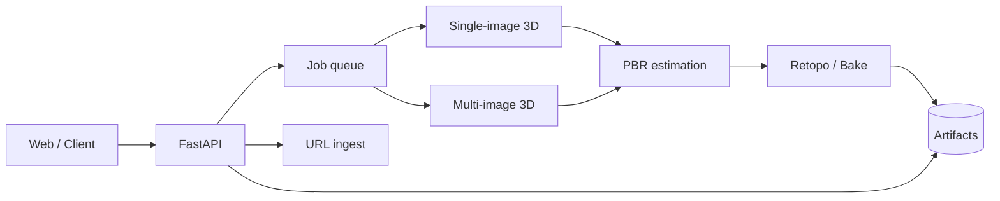

# Pix2Poly 시스템 설계 (초안)

## 목표

웹 UI/API가 **이미지 소스**(업로드 또는 URL)를 받아, 백엔드 오케스트레이터가 **3D 생성·PBR·최적화** 작업을 큐에 넣고 결과(GLB + 텍스처)를 반환한다.

## 논리 구성

현재 저장소의 `backend`는 **API + 인메모리 잡 상태**까지 구현하고, 실제 TripoSR/InstantMesh/MVSplat 등은 **외부 워커 프로세스 또는 컨테이너**로 연결하는 것을 권장한다.

## 잡 모델

- `job_id`: UUID
- `status`: `queued` | `running` | `succeeded` | `failed`
- `input`: 단일/다중 이미지 또는 URL에서 추출한 이미지 URL 목록
- `output`: (향후) 아티팩트 경로, 로그

## URL 인제스트

1. `GET` 대상 페이지 (User-Agent 식별, 타임아웃, 크기 제한)
2. `urllib.robotparser`로 해당 URL fetch 허용 여부 검사 (선택적 차단)
3. HTML 파싱으로 이미지 URL 수집
4. 중복 제거 후 후보 목록 반환 (실제 다운로드는 사용자 선택 또는 잡 단계에서)

## 보안·컴플라이언스

- SSRF 방지: 스킴 `http`/`https`만, 사설 IP 차단(옵션)
- 다운로드 크기·개수 상한
- 로그에 민감 정보 최소화

## 다음 단계

- Redis/RQ 또는 Celery로 큐 이관
- 객체 스토리지(S3 등)에 GLB/텍스처 저장
- GPU 워커 이미지 및 모델 버전 핀ning
